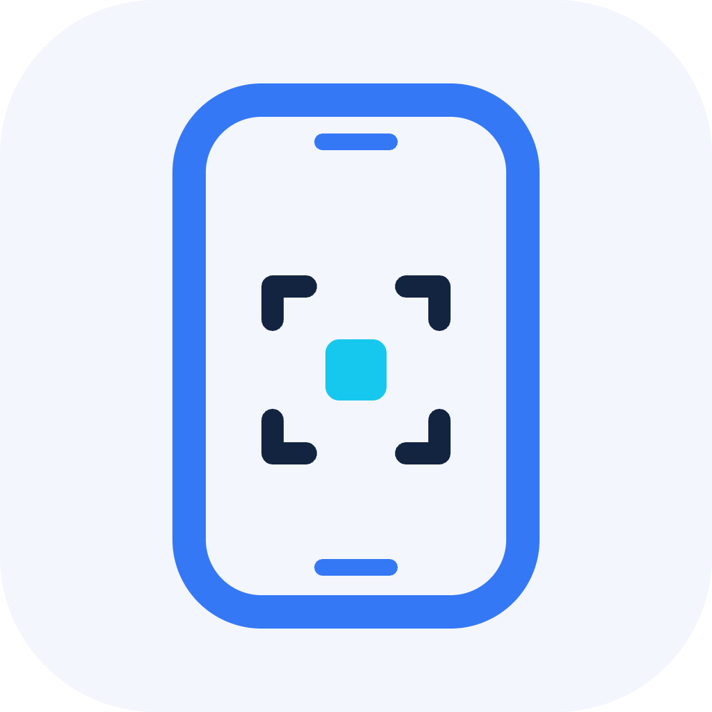

# Sim Stage



Inspect and control Apple simulators beside a conversation. Humans use the live viewer; agents read accessibility elements, act on current targets, and verify the resulting screen. Sim Stage also exposes eligible connected Apple devices through Xcode's interaction bridge.

## Requirements

- Apple Silicon Mac, Bun 1.4.2 or later, and Xcode 27 with an installed simulator runtime.
- Xcode open with **Settings → Intelligence → Model Context Protocol** enabled.
- A desktop host that supports local stdio MCP and MCP Apps. Local installation does not make the server available on web or mobile.

Physical devices must be paired, connected and eligible for Apple's interaction tools. Simulator video uses hardware HEVC with H.264 fallback. The helper targets macOS 14 or later; the current development checks use macOS 27 and Xcode 27.

## Install from source

```sh
git clone https://github.com/rishirsv/simstage.git
cd simstage
bun install --frozen-lockfile
bun run dev:plugin
codex plugin marketplace add "$PWD/.dev-plugin" --json
codex plugin add sim-stage@sim-stage-dev --json
```

Start a new Codex chat after installation. Rebuild and repeat the last two commands to update the installed copy; the development build uses a fresh cache version. The checkout supplies its bundled runtime, so this install does not depend on a published npm package.

Ask “Open Sim Stage and show my available simulators.” Select a device, inspect its screen, and use current accessibility refs for actions. For visual checks, request `screenshot: "always"`. The bundled [drive-simulator skill](plugins/sim-stage/skills/drive-simulator/SKILL.md) explains selection, snapshots, input, setting restoration and cleanup.

For another local MCP client, build with `bun run build` and start `bun packages/sim-stage-mcp/dist/server.js` from the repository root. The root `.mcp.json` declares that command. To inspect the viewer in a browser, run `bun run preview` and open the loopback URL printed by the server.

## Use and data

Use development and sample data. Screen images, element text and tool arguments can reach the assistant. Secure accessibility-field text values are redacted and typing into observed secure fields is rejected; screenshots and video do not have general-purpose content redaction. Device settings and app actions can have lasting effects. Restore temporary settings and disconnect sessions when finished.

See [privacy and data handling](PRIVACY.md), [security](SECURITY.md) and [terms](TERMS.md). Public Directory submission, publishing identity verification and public hosting remain separate from the working local plugin.

## Development

```sh
bun run typecheck
bun run build
bun test
bun run pack
bun run verify:packages
```

The ZIP in `release/` includes the runtime, signed native helper, skill and icons. The npm archive contains the runtime. Both are tested from extracted directories. The helper uses an ad-hoc signature; this is not Developer ID notarization. Review [CONTRIBUTING.md](CONTRIBUTING.md) for development and release checks.

`src/` owns the MCP server and viewer, `native/` owns simulator capture/input, `plugins/sim-stage/` owns the plugin metadata, skill and assets, and `scripts/` owns builds, packaging and benchmarks. Build output, recordings and audit history live in ignored `release/` and `artifacts/` directories.

This layout follows [OpenAI's plugin examples](https://github.com/openai/plugins): a repository marketplace pointing to a self-contained plugin directory. It does not imply OpenAI endorsement or Directory approval.

## License and attribution

MIT licensed; see [LICENSE](LICENSE). Sim Stage derives from [Max Weinbach's Apple simulator plugin](https://github.com/mweinbach/AppleSimChatGPTPlugin). Original attribution is retained in [NOTICE](NOTICE). Bundled dependency notices ship with the runtime. Sim Stage is independent of Apple and OpenAI.
