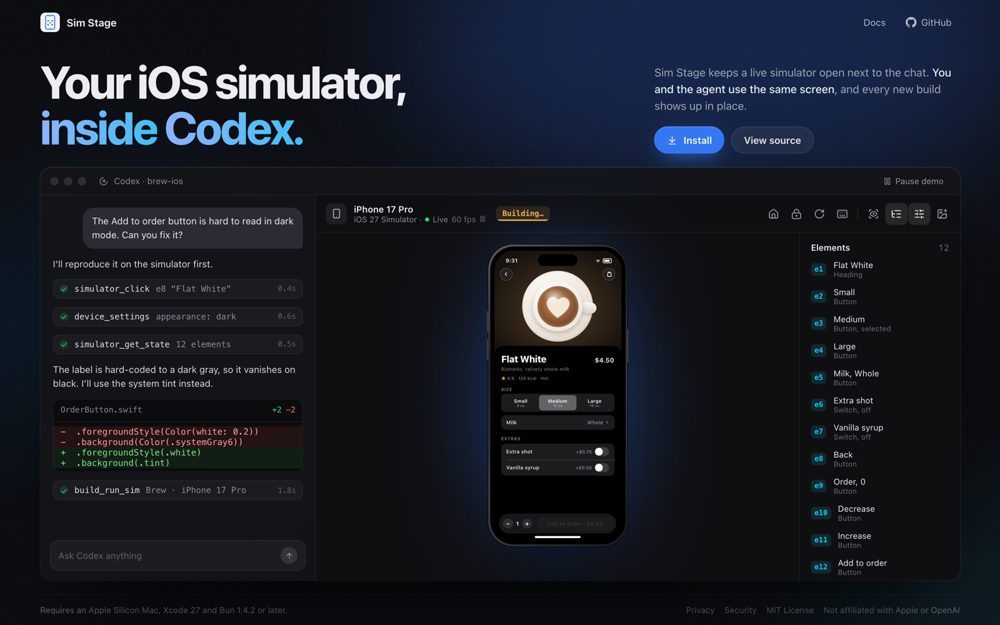

# Sim Stage

Sim Stage is a Codex plugin and local MCP server that shows a live Apple simulator viewer beside a chat. You and the agent drive the same screen: you tap in the viewer, and the agent reads accessibility elements, acts on them and checks the result.



Website: <https://rishirsv.github.io/simstage/>

## Requirements

- Apple Silicon Mac, Bun 1.4.2 or later, and Xcode 27 with an installed simulator runtime.
- Xcode open with **Settings → Intelligence → Model Context Protocol** enabled.
- A desktop host that supports local stdio MCP and MCP Apps. A local install is not available on web or mobile.

Physical devices must be paired, connected and eligible for Apple's interaction tools. Simulator video uses hardware HEVC with H.264 fallback. The native helper targets macOS 14 or later; development checks run on macOS 27 and Xcode 27.

## Install from source

```sh
git clone https://github.com/rishirsv/simstage.git
cd simstage
bun install --frozen-lockfile
bun run dev:plugin
codex plugin marketplace add "$PWD/.dev-plugin" --json
codex plugin add sim-stage@sim-stage-dev --json
```

Start a new Codex chat after installing. To update, rebuild and repeat the last two commands. The checkout supplies its own runtime, so this install does not need a published npm package.

## Usage

Ask "Open Sim Stage and show my available simulators." Select a device, inspect its screen, and act on current accessibility refs. For visual checks, request `screenshot: "always"`. The bundled [drive-simulator skill](plugins/sim-stage/skills/drive-simulator/SKILL.md) covers device selection, snapshots, input, restoring settings and cleanup.

For another local MCP client, run `bun run build` and start `bun packages/sim-stage-mcp/dist/server.js` from the repository root; the root `.mcp.json` declares that command. To inspect the viewer in a browser, run `bun run preview` and open the loopback URL it prints.

## Tools

Agent-facing tools:

| Tool | Purpose |
| --- | --- |
| `open_sim_stage` | Show the live viewer. |
| `sim_stage_preferences` | Open device and accessibility controls. |
| `sim_stage_status` | List sessions, devices open in other chats, running and shut-down simulators, and paired devices. |
| `device_connect` | Open a session on a device ID; boots a stopped simulator. |
| `device_disconnect` | End a session and release its resources. |
| `simulator_create` | Create or clone a simulator for isolated testing. |
| `simulator_delete` | Delete a simulator that Sim Stage created. |
| `device_capture` | Read elements and, when needed or requested, a screenshot. |
| `device_action` | Tap, type, scroll, swipe, press buttons, rotate, launch an app or open Settings. |
| `device_settings` | Read or change appearance, Dynamic Type, motion, transparency and contrast. |
| `simulator_get_state` | Observe a simulator: elements, logical coordinates and snapshot. |
| `simulator_screenshot` | Capture an image of the simulator screen. |
| `simulator_click` | Click, double click or long press an element, selector or point. |
| `simulator_drag` | Drag between two logical points. |
| `simulator_scroll` | Scroll the screen or an element. |
| `simulator_type_text` | Type text, optionally focusing a target first. |
| `simulator_press_key` | Press Return, Tab, Backspace, Home, Lock or a volume key. |

The viewer also uses app-only tools (`device_frame`, `device_stream`, `device_stream_read`, `device_stream_stop`, `device_input`) for video and live touch. Agents should not call them. Input never targets the Mac desktop.

## Compared with serve-sim

The `serve-sim` mirror in OpenAI's build-ios-apps plugin shows a simulator in the Codex browser, together with SwiftUI preview hot reload. Sim Stage is a separate MCP server. It renders its viewer inside the host as an MCP App and does not need a terminal or loopback URL. It gives the agent accessibility-based observation and input, device settings, and simulator create and delete. It does not build apps or generate SwiftUI previews; use the build tools for that.

## Privacy and safety

Use development apps and sample data. Screen images, element text and tool arguments can reach the assistant. Secure accessibility-field text is redacted and typing into observed secure fields is rejected, but screenshots and video are not redacted. Device settings and app actions can have lasting effects: restore temporary settings and disconnect when finished.

See [PRIVACY.md](PRIVACY.md), [SECURITY.md](SECURITY.md) and [TERMS.md](TERMS.md). The optional preview server binds to loopback only.

## Development

```sh
bun run typecheck
bun run build
bun test
bun run pack
bun run verify:packages
```

`bun run pack` writes a ZIP and an npm archive to `release/`. The ZIP holds the runtime, native helper, skill and icons; the npm archive holds the runtime. Both are tested from extracted directories. The helper uses an ad-hoc signature, not Developer ID notarization. See [CONTRIBUTING.md](CONTRIBUTING.md).

## Layout

- `src/`: MCP server and viewer.
- `native/`: simulator capture and input helper (Objective-C).
- `plugins/sim-stage/`: plugin manifest, skill and icons.
- `scripts/`: build, packaging and benchmark scripts.
- `sites/`: static website, deployed to GitHub Pages.
- `release/`, `artifacts/`: ignored build output and measurements.

The plugin layout follows [OpenAI's plugin examples](https://github.com/openai/plugins). It does not imply OpenAI endorsement.

## License and attribution

MIT; see [LICENSE](LICENSE). Sim Stage derives from [Max Weinbach's Apple simulator plugin](https://github.com/mweinbach/AppleSimChatGPTPlugin); attribution is kept in [NOTICE](NOTICE). Bundled dependency notices ship with the runtime. Sim Stage is independent of Apple and OpenAI.

Everyone taking part is expected to follow the [Code of Conduct](CODE_OF_CONDUCT.md).
